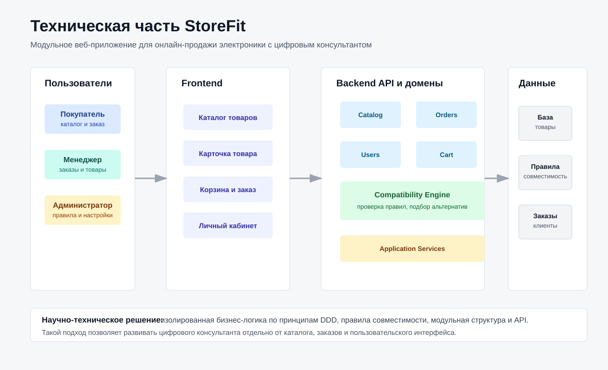

# Основная часть отчета ВКР

Тема: **Разработка веб-приложения для онлайн-продажи электроники с модульной архитектурой и изолированной бизнес-логикой по принципам DDD**

## 1 Техническое задание

### 1.1 Общие сведения

#### 1.1.1 Наименование разрабатываемой системы

Наименованием разрабатываемой системы является веб-приложение для онлайн-продажи электроники с модульной архитектурой и изолированной бизнес-логикой по принципам Domain-Driven Design. В рамках работы система рассматривается как программный комплекс StoreFit, предназначенный для организации собственного канала онлайн-продаж магазина электроники.

Разрабатываемое приложение включает клиентскую часть, серверную часть, базу данных, механизмы авторизации, каталог товаров, корзину покупателя, оформление заказов, учет складских остатков, административные функции и модуль цифрового консультанта для проверки совместимости товаров.

#### 1.1.2 Назначение документа

Настоящее техническое задание определяет назначение, цели, требования и ожидаемые результаты разработки веб-приложения. Документ используется как исходная основа для анализа предметной области, проектирования архитектуры, реализации ключевых модулей и проверки полученного результата.

Техническое задание фиксирует требования к функциональности, структуре, программной совместимости, пользовательским ролям, архитектурному подходу и качеству реализации. На его основе в последующих разделах выполняется аналитический обзор, проектирование и реализация программной системы.

#### 1.1.3 Область применения

Областью применения разрабатываемого веб-приложения является электронная коммерция, а именно онлайн-продажа электроники, комплектующих, аксессуаров и связанных с ними товаров. Система ориентирована на малые и средние магазины электроники, которым требуется не только стандартная интернет-витрина, но и инструмент консультации покупателей при выборе технически совместимых товаров.

В отличие от продажи простых товаров, продажа электроники связана с большим количеством технических характеристик. При выборе комплектующих покупатель должен учитывать совместимость по сокету, интерфейсу, типу памяти, форм-фактору, мощности, модели устройства и другим параметрам. Ошибка выбора может привести к отказу от покупки, возврату товара или необходимости ручной консультации со стороны менеджера. Поэтому веб-приложение должно поддерживать не только каталог и заказ, но и предметные правила, связанные с электроникой.

### 1.2 Назначение и цели создания веб-приложения

#### 1.2.1 Эксплуатационное назначение

Основным эксплуатационным назначением веб-приложения является обеспечение полного пользовательского сценария онлайн-покупки электроники. Пользователь должен иметь возможность просматривать каталог, искать и фильтровать товары, изучать карточку товара, добавлять товары в корзину, проверять совместимость выбранных товаров, оформлять заказ и просматривать историю своих заказов.

Для менеджера магазина система должна предоставлять административные функции: управление товарами, категориями, изображениями, импортом и экспортом товарных данных, пополнением складских остатков, а также настройкой правил совместимости. Таким образом, приложение должно использоваться как покупателем, так и сотрудником магазина.

#### 1.2.2 Цель создания веб-приложения

Целью работы является разработка веб-приложения для онлайн-продажи электроники, построенного на основе модульной архитектуры и изолированной бизнес-логики по принципам Domain-Driven Design.

Для достижения поставленной цели необходимо решить следующие задачи:

- провести анализ предметной области онлайн-продажи электроники;
- определить основные роли пользователей и бизнес-процессы системы;
- обосновать необходимость модульного архитектурного подхода;
- выделить ограниченные контексты предметной области;
- спроектировать доменные модели ключевых модулей;
- спроектировать взаимодействие модулей через доменные события;
- реализовать серверную часть приложения;
- реализовать клиентскую часть приложения;
- реализовать механизм авторизации и разграничения ролей;
- реализовать каталог товаров, корзину, заказ и складской учет;
- реализовать цифрового консультанта для проверки совместимости товаров;
- проверить работоспособность ключевых сценариев и архитектурную изоляцию модулей.

#### 1.2.3 Целевая аудитория

Целевой аудиторией разрабатываемой системы являются две основные группы пользователей.

Первая группа - покупатели электроники. Им необходим удобный инструмент поиска товара, сравнения характеристик, добавления товаров в корзину и оформления заказа. Для этой группы особенно важны понятность интерфейса, наличие актуальных данных о товарах и складских остатках, а также помощь при выборе совместимых товаров.

Вторая группа - менеджеры магазина. Для них система является инструментом управления товарным каталогом и заказами. Менеджер должен иметь возможность изменять товарные карточки, загружать изображения, импортировать и экспортировать данные, пополнять остатки и управлять правилами цифрового консультанта.

### 1.3 Требования к веб-приложению

#### 1.3.1 Функциональные требования

Веб-приложение должно обеспечивать следующие функциональные возможности:

- регистрацию и авторизацию пользователей;
- разграничение доступа между покупателем и менеджером;
- просмотр каталога товаров;
- поиск товаров по наименованию и другим параметрам;
- фильтрацию товаров по категории, бренду, цене, наличию и характеристикам;
- просмотр подробной карточки товара;
- отображение изображений товара;
- добавление товара в корзину;
- изменение количества товара в корзине;
- удаление товара из корзины;
- оформление заказа;
- проверку складских остатков при создании заказа;
- резервирование товаров на складе;
- оплату заказа;
- отмену заказа;
- просмотр заказов пользователя;
- управление товарами и категориями;
- загрузку и назначение основного изображения товара;
- импорт и экспорт товарных данных;
- пополнение складских остатков;
- проверку совместимости товаров в корзине;
- выдачу рекомендаций по совместимым товарам;
- создание, изменение, тестирование и удаление правил совместимости.

#### 1.3.2 Нефункциональные требования

К нефункциональным требованиям относятся:

- корректная работа приложения в веб-браузере;
- разделение клиентской и серверной частей;
- хранение данных в реляционной базе данных;
- возможность контейнерного запуска приложения;
- защита административных функций от неавторизованного доступа;
- устойчивость ключевых бизнес-сценариев к повторной обработке событий;
- возможность дальнейшего расширения системы без нарушения существующих модулей;
- отделение бизнес-логики от инфраструктурных деталей;
- проверяемость доменной логики автоматическими тестами.

#### 1.3.3 Требования к архитектуре

Серверная часть веб-приложения должна быть реализована как модульный монолит. Данный подход позволяет запускать систему как единое приложение, но при этом разделять бизнес-логику на независимые модули. Такое решение является более простым для разработки и эксплуатации по сравнению с микросервисной архитектурой, но позволяет сохранить важные преимущества модульности.

Каждый бизнес-модуль должен иметь собственную область ответственности. Модули не должны обращаться напрямую к внутренним слоям других модулей. Для межмодульного взаимодействия должны использоваться контрактные проекты и доменные события.

Внутри модулей должна соблюдаться слоистая структура:

- Domain - доменная модель и бизнес-правила;
- Application - сценарии использования, команды, запросы, обработчики;
- Infrastructure - доступ к данным, реализации репозиториев, интеграции;
- API - контроллеры и внешние HTTP-методы.

#### 1.3.4 Требования к изоляции бизнес-логики

Бизнес-логика должна быть сосредоточена в доменных моделях и доменных сервисах. Контроллеры не должны содержать правила предметной области. Их задача заключается в приеме HTTP-запросов, передаче данных в application layer и возврате результата клиенту.

Доменные модели должны самостоятельно контролировать допустимость операций. Например, заказ не должен переходить в статус оплаты, если он еще ожидает резервирования склада. Корзина не должна позволять изменять состав во время незавершенного оформления заказа. Склад не должен резервировать больше товара, чем доступно.

#### 1.3.5 Требования к программной совместимости

Серверная часть должна быть реализована на платформе .NET с использованием ASP.NET Core. Клиентская часть должна быть реализована как React-приложение на TypeScript. В качестве базы данных должна использоваться PostgreSQL. Для контейнерного запуска должны использоваться Docker и Docker Compose.

#### 1.3.6 Требования к данным

В системе должны храниться следующие группы данных:

- учетные записи пользователей;
- роли пользователей;
- категории товаров;
- товарные карточки;
- технические характеристики товаров;
- изображения товаров;
- складские остатки;
- корзины покупателей;
- позиции корзины;
- заказы;
- позиции заказов;
- резервы складских остатков;
- правила совместимости товаров;
- результаты проверки совместимости;
- сообщения для отправки уведомлений;
- служебные данные для обработки доменных событий.

Данные должны быть разделены по модулям. Для каждого ограниченного контекста должна использоваться собственная схема базы данных. Такое разделение необходимо для поддержки модульной архитектуры: данные каталога, корзины, заказов и склада не должны смешиваться в одной общей модели.

#### 1.3.7 Требования к надежности

Ключевые сценарии системы должны выполняться надежно даже при наличии повторной доставки событий или временных ошибок обработки. Особенно это относится к оформлению заказа, так как данный процесс затрагивает несколько модулей и изменяет состояние корзины, заказа и склада.

Для повышения надежности необходимо:

- сохранять доменные события в базе данных до их публикации;
- обрабатывать события в фоновом режиме;
- поддерживать повторные попытки обработки;
- фиксировать обработанные события;
- предотвращать повторное создание заказа при повторной обработке события checkout;
- предотвращать повторное резервирование товара;
- не очищать корзину до подтверждения создания заказа.

#### 1.3.8 Требования к интерфейсу

Пользовательский интерфейс должен обеспечивать выполнение основных сценариев без обращения к внутренней структуре системы. Покупателю должны быть доступны каталог, карточка товара, корзина, оформление заказа и история заказов. Менеджеру должна быть доступна административная панель.

Интерфейс должен отображать:

- список товаров;
- категории;
- фильтры;
- цену;
- наличие товара;
- изображения товара;
- состав корзины;
- форму оформления заказа;
- статусы заказов;
- результаты проверки совместимости;
- административные формы управления товарами, остатками и правилами.

#### 1.3.9 Требования к тестированию

Разрабатываемая система должна быть проверена автоматическими тестами. Тестирование должно охватывать не только контроллеры или пользовательский интерфейс, но и доменную логику. Это особенно важно, так как тема работы связана с изолированной бизнес-логикой по принципам DDD.

Должны быть проверены:

- создание и изменение товаров;
- валидация характеристик электроники;
- операции с корзиной;
- оформление заказа;
- переходы статусов заказа;
- резервирование, освобождение и списание складских остатков;
- проверка совместимости товаров;
- идемпотентность обработки событий;
- изоляция архитектурных слоев и модулей.

### 1.4 Состав и содержание работ

Процесс разработки системы включает следующие этапы:

1. Формирование технического задания.
2. Анализ предметной области онлайн-продажи электроники.
3. Анализ архитектурных подходов и выбор модульного монолита.
4. Выделение ограниченных контекстов.
5. Проектирование доменных моделей.
6. Проектирование базы данных.
7. Проектирование взаимодействия модулей через события.
8. Реализация backend-части.
9. Реализация frontend-части.
10. Реализация сценария оформления заказа.
11. Реализация складского резервирования.
12. Реализация цифрового консультанта.
13. Реализация тестов.
14. Проверка результата.

Ожидаемым результатом является работоспособное веб-приложение, демонстрирующее полный сценарий онлайн-покупки электроники и подтверждающее возможность применения DDD и модульной архитектуры для изоляции бизнес-логики.

### 1.5 Выводы по разделу

В процессе выполнения данного раздела было сформировано техническое задание на разработку веб-приложения для онлайн-продажи электроники. Были определены назначение системы, целевая аудитория, функциональные и нефункциональные требования, а также требования к архитектуре и изоляции бизнес-логики.

На основе сформированного технического задания можно сделать вывод, что разрабатываемая система должна представлять собой не только интернет-магазин, но и предметно-ориентированное приложение, учитывающее особенности продажи электроники. Эти особенности определяют необходимость дальнейшего анализа предметной области и выбора архитектурного подхода, позволяющего разделить сложную бизнес-логику на независимые модули.

## 2 Аналитический обзор

### 2.1 Анализ предметной области

#### 2.1.1 Особенности онлайн-продажи электроники

Онлайн-продажа электроники относится к области электронной коммерции, но имеет ряд особенностей, отличающих ее от продажи товаров массового спроса. Электроника часто обладает большим количеством технических характеристик, которые определяют область применения товара и его совместимость с другими устройствами.

Например, при продаже процессоров важны сокет, поддерживаемый набор микросхем и энергопотребление. Для оперативной памяти значимы тип памяти, объем и форм-фактор. Для накопителей важны интерфейс, емкость и формат устройства. Для аксессуаров и периферии необходимо учитывать тип разъема, модель устройства и группу совместимости.

В традиционном интернет-магазине такие данные обычно используются только для отображения в карточке товара или фильтрации. Однако в магазине электроники характеристики могут использоваться как основа для предметных правил. Если покупатель добавляет в корзину материнскую плату и процессор, система может проверить совпадение сокета. Если в корзине находится видеокарта, система может проверить рекомендуемую мощность блока питания. Таким образом, характеристики становятся не просто описанием товара, а частью бизнес-логики.

#### 2.1.2 Основные бизнес-процессы интернет-магазина электроники

В предметной области можно выделить следующие бизнес-процессы:

- регистрация и авторизация пользователя;
- просмотр и поиск товаров;
- фильтрация товаров по категории, цене, бренду и характеристикам;
- просмотр карточки товара;
- добавление товара в корзину;
- изменение состава корзины;
- проверка совместимости товаров;
- оформление заказа;
- резервирование складских остатков;
- оплата заказа;
- отмена заказа;
- уведомление пользователя о событиях заказа;
- управление каталогом со стороны менеджера;
- пополнение складских остатков;
- настройка правил совместимости.

Наиболее сложным бизнес-процессом является оформление заказа, так как он затрагивает сразу несколько областей: корзину, заказ, склад, уведомления и доступность товара в каталоге. Если эти области реализовать в одном общем модуле без явных границ, система быстро становится сложной для развития. Поэтому уже на этапе анализа возникает необходимость выделения отдельных зон ответственности.

#### 2.1.3 Участники системы

В системе выделены два основных типа пользователей: покупатель и менеджер.

Покупатель взаимодействует с публичной частью веб-приложения. Он просматривает товары, добавляет их в корзину, оформляет заказ, оплачивает заказ и просматривает историю покупок. Для покупателя важно, чтобы приложение было понятным, а данные о наличии товаров были актуальными.

Менеджер взаимодействует с административной частью. Он управляет товарными карточками, категориями, изображениями, импортом и экспортом данных, остатками и правилами совместимости. Для менеджера важно, чтобы бизнес-логика системы была предсказуемой, а действия в одном модуле не нарушали работу других частей приложения.

#### 2.1.4 Проблемы предметной области

В ходе анализа предметной области были выделены проблемы, которые должна учитывать проектируемая система.

Первая проблема связана с большим количеством технических характеристик. Если характеристики не нормализованы, их трудно использовать для поиска, фильтрации и проверки совместимости. Например, одна и та же характеристика может быть записана в разных формах. Для обычного отображения это может быть допустимо, но для автоматической проверки такие различия становятся проблемой.

Вторая проблема связана с ошибками выбора. Покупатель может выбрать несовместимые товары, потому что не обладает достаточной технической экспертизой. В традиционном магазине эту проблему решает продавец-консультант. В веб-приложении часть такой экспертизы должна быть перенесена в программную систему.

Третья проблема связана со складскими остатками. Если система показывает товар как доступный, но при оформлении заказа фактически товара нет, пользовательский сценарий нарушается. Поэтому наличие товара должно быть связано не только с каталогом, но и со складским модулем.

Четвертая проблема связана с расширяемостью. Интернет-магазин электроники может постепенно развиваться: добавлять новые категории, характеристики, способы оплаты, правила совместимости и сценарии уведомлений. Если все эти правила реализовать в одной общей модели, дальнейшее развитие системы будет затруднено.

#### 2.1.5 Постановка задачи разработки

На основании выявленных проблем задача разработки формулируется следующим образом: необходимо создать веб-приложение интернет-магазина электроники, в котором стандартные функции электронной коммерции дополнены предметной логикой работы с техническими характеристиками, складскими остатками и совместимостью товаров.

При этом система должна быть спроектирована таким образом, чтобы отдельные бизнес-области не смешивались между собой. Каталог должен отвечать за товары и характеристики, корзина - за временный выбор пользователя, заказы - за оформление покупки, склад - за остатки и резервирование, консультационный модуль - за проверку совместимости. Такое разделение является предпосылкой для применения модульной архитектуры и DDD.

### 2.2 Обзор существующих решений и подходов

#### 2.2.1 Типовые интернет-магазины

Типовые интернет-магазины предоставляют базовый набор функций: каталог товаров, корзину, оформление заказа и административную панель. Такой подход подходит для многих предметных областей, но не всегда учитывает специфику электроники. В большинстве случаев совместимость товаров остается ответственностью покупателя или менеджера.

Недостатком такого подхода является то, что система не использует технические характеристики как активную часть бизнес-логики. Характеристики отображаются пользователю, но не помогают автоматически выявлять ошибки выбора. В результате покупатель может оформить несовместимый набор товаров, а менеджер должен вручную проверять заказ.

#### 2.2.2 Маркетплейсы

Маркетплейсы предоставляют продавцам готовую инфраструктуру продаж и большой пользовательский трафик. Однако для малого магазина электроники такая модель имеет ограничения. Продавец зависит от правил площадки, комиссий, алгоритмов ранжирования и не всегда имеет прямой контроль над клиентским опытом.

Кроме того, маркетплейс обычно не позволяет магазину полноценно реализовать собственную предметную экспертизу. Товарные карточки унифицированы, а сложная консультационная логика либо отсутствует, либо доступна только в ограниченном виде. Поэтому собственный интернет-магазин может рассматриваться как инструмент развития отдельного канала продаж и повышения качества консультации.

#### 2.2.3 Конфигураторы и цифровые консультанты

Для электроники существуют специализированные конфигураторы, например для подбора компьютерных комплектующих. Такие решения демонстрируют востребованность автоматической проверки совместимости. Однако они часто ориентированы на узкую область, например сборку персонального компьютера, и не всегда подходят для магазина с разными категориями товаров.

В рамках данной работы более универсальным решением является модуль цифрового консультанта, в котором совместимость задается правилами. Такой подход позволяет менеджеру описывать условия для разных категорий товаров без изменения основной архитектуры приложения.

#### 2.2.4 Сравнительная характеристика подходов

Для определения особенностей разрабатываемого решения проведено сравнение типовых подходов, применяемых в области онлайн-продажи электроники.

| Подход | Преимущества | Недостатки | Применимость к проекту |
| --- | --- | --- | --- |
| Типовой интернет-магазин | Простота, наличие каталога и корзины | Слабая поддержка предметных правил совместимости | Может быть основой, но требует расширения |
| Маркетплейс | Готовый трафик, инфраструктура продаж | Зависимость от площадки, ограниченная кастомизация | Не решает задачу собственной предметной логики |
| Узкий конфигуратор | Хорошая проверка совместимости в одной области | Ограниченность конкретным сценарием | Полезен как идея, но недостаточно универсален |
| Модульный магазин с цифровым консультантом | Собственный канал продаж, расширяемые правила, изолированная логика | Требует более сложной архитектуры | Соответствует цели работы |

Из сравнения следует, что разрабатываемая система должна объединять функции интернет-магазина и консультационного механизма. При этом консультационная логика должна быть встроена в архитектуру как отдельный модуль, а не как набор случайных проверок в пользовательском интерфейсе.

### 2.3 Анализ архитектурных подходов

#### 2.3.1 Монолитная архитектура

Монолитная архитектура предполагает разработку приложения как единого программного блока. Ее преимуществами являются простота запуска, единая кодовая база, отсутствие сложной сетевой коммуникации между сервисами и удобство начальной разработки.

Недостатком классического монолита является риск смешивания бизнес-логики разных областей. Если каталог, корзина, заказы и склад не имеют четких границ, изменение одного сценария может затрагивать множество несвязанных частей системы. Для предметной области электроники это особенно критично, так как бизнес-правила постепенно усложняются.

#### 2.3.2 Микросервисная архитектура

Микросервисная архитектура предполагает разделение системы на независимые сервисы, каждый из которых может разрабатываться и развертываться отдельно. Такой подход хорошо подходит для крупных систем с большими командами и высокой нагрузкой.

Однако микросервисная архитектура усложняет инфраструктуру. Требуется решать вопросы сетевого взаимодействия, распределенных транзакций, мониторинга, версионирования контрактов и развертывания нескольких сервисов. Для выпускной квалификационной работы и для системы уровня малого интернет-магазина такой подход может быть избыточным.

#### 2.3.3 Модульный монолит

Модульный монолит совмещает преимущества монолита и модульного разделения. Приложение запускается как единый backend, но внутри разделено на модули. Каждый модуль отвечает за собственную часть предметной области, имеет собственную доменную модель и собственную инфраструктуру хранения данных.

В рамках разрабатываемой системы данный подход является наиболее подходящим. Он позволяет сохранить простоту запуска и разработки, но при этом обеспечить архитектурную изоляцию бизнес-логики. Модули могут взаимодействовать через события и контракты, не обращаясь к внутренней реализации друг друга.

#### 2.3.4 Обоснование выбора DDD

Domain-Driven Design применяется в системах, где основная сложность заключается в предметной области. В рассматриваемом проекте такая сложность выражена в нескольких аспектах:

- разные модули имеют разные бизнес-правила;
- заказ зависит от состояния склада;
- корзина должна корректно реагировать на успешное или отклоненное оформление;
- каталог должен учитывать доступность товара;
- совместимость товаров зависит от характеристик;
- правила совместимости должны быть расширяемыми.

DDD позволяет описывать такие правила через доменные модели, агрегаты, объекты-значения, доменные сервисы и события. Поэтому данный подход соответствует цели работы и позволяет обосновать архитектуру приложения не только технически, но и с точки зрения предметной области.

#### 2.3.5 Сравнение архитектурных подходов

Для выбора архитектурного подхода были сопоставлены классический монолит, микросервисная архитектура и модульный монолит.

| Критерий | Классический монолит | Микросервисы | Модульный монолит |
| --- | --- | --- | --- |
| Простота запуска | Высокая | Низкая | Высокая |
| Изоляция бизнес-логики | Низкая без дополнительных правил | Высокая | Высокая при соблюдении границ |
| Сложность инфраструктуры | Низкая | Высокая | Средняя |
| Поддержка DDD | Возможна, но границы легко нарушить | Хорошая | Хорошая |
| Подходит для ВКР | Частично | Избыточно | Да |
| Подходит для малого магазина | Да, но есть риск роста сложности | Обычно избыточно | Да |

На основании сравнения выбран модульный монолит. Он позволяет реализовать предметные границы, не усложняя систему распределенной инфраструктурой. Для данной работы это особенно важно, так как основная цель заключается не в построении распределенной системы, а в демонстрации изолированной бизнес-логики.

### 2.4 Выбор средств разработки

#### 2.4.1 Серверная часть

Для реализации серверной части выбран ASP.NET Core. Данная платформа позволяет создавать REST API, поддерживает встроенные механизмы middleware, авторизации, dependency injection, фоновых сервисов, health checks и интеграции со Swagger.

Для доступа к данным выбран Entity Framework Core. Он позволяет описывать модели данных на языке C#, создавать миграции и работать с PostgreSQL через провайдер Npgsql. Для реализации команд, запросов и обработчиков событий используется MediatR.

#### 2.4.2 Клиентская часть

Для реализации клиентской части выбран React с использованием TypeScript. React позволяет строить интерфейс из компонентов, а TypeScript повышает надежность разработки за счет статической типизации. Для сборки используется Vite, обеспечивающий быстрый запуск и сборку приложения.

Маршрутизация реализуется с помощью React Router. Работа с серверными данными организуется через TanStack React Query и собственный API-клиент. Для стилизации используется styled-components.

#### 2.4.3 База данных и инфраструктура

В качестве базы данных выбрана PostgreSQL. Данная СУБД подходит для хранения структурированных данных интернет-магазина, поддерживает схемы, индексы, транзакции и ограничения целостности.

Для контейнеризации используется Docker Compose. Он позволяет запускать backend, frontend и базу данных в отдельных контейнерах, объединенных внутренней сетью. Такое решение удобно для демонстрации, разработки и дальнейшего развертывания.

#### 2.4.4 Средства реализации архитектурных механизмов

Для реализации модульной архитектуры и DDD используются дополнительные средства.

MediatR применяется для обработки команд, запросов и доменных событий. Это позволяет отделить точку вызова сценария от его обработчика. Контроллер не выполняет бизнес-логику напрямую, а передает команду или запрос соответствующему обработчику.

CSharpFunctionalExtensions используется для возврата результатов операций. Вместо выбрасывания исключений для обычных бизнес-ошибок методы возвращают Result. Такой подход удобен для доменной логики: например, агрегат может вернуть ошибку при попытке оплатить отклоненный заказ или зарезервировать недостаточное количество товара.

Outbox/Inbox реализуется в отдельном проекте Store.EventOutbox. Данный механизм необходим для надежной обработки событий между модулями. Он также позволяет описать систему как событийно-согласованную, что соответствует модульному подходу.

### 2.5 Выводы по разделу

В процессе выполнения аналитического обзора была рассмотрена предметная область онлайн-продажи электроники. Было показано, что данная область отличается от типового интернет-магазина наличием технических характеристик, правил совместимости и необходимости согласованной работы каталога, корзины, заказов и склада.

Были рассмотрены основные архитектурные подходы. Наиболее подходящим для проекта выбран модульный монолит с применением принципов Domain-Driven Design. Такой подход позволяет сохранить простоту единого приложения и одновременно изолировать бизнес-логику по ограниченным контекстам. Также были выбраны основные средства разработки: ASP.NET Core, React, TypeScript, PostgreSQL, Entity Framework Core, MediatR и Docker Compose.

## 3 Проектирование

### 3.1 Требования к проектированию

Проектирование веб-приложения выполняется на основе технического задания и результатов аналитического обзора. Основное требование к проектированию заключается в том, что структура системы должна соответствовать предметной области. Это означает, что каталог, корзина, заказы, склад, пользователи, уведомления и консультационный механизм должны рассматриваться как отдельные зоны ответственности.

Дополнительно проектирование должно учитывать возможность дальнейшего расширения системы. Например, правила совместимости могут развиваться, список категорий электроники может увеличиваться, а сценарии оформления заказа могут дополняться новыми способами доставки или оплаты.

### 3.2 Общая архитектура системы

Веб-приложение проектируется как система, состоящая из трех основных частей: клиентского приложения, серверного API и базы данных. Клиентская часть реализуется на React и взаимодействует с серверной частью по HTTP через REST API. Серверная часть реализуется на ASP.NET Core и содержит модульный монолит. Данные хранятся в PostgreSQL.

На рисунке 3.1 представлена общая архитектура разрабатываемого приложения.

Рисунок 3.1 - Общая техническая архитектура веб-приложения

Внутри серверной части выделены следующие бизнес-модули:

- Identity;
- Catalog;
- Carts;
- Ordering;
- Inventory;
- Notifications;
- Consulting.

Каждый модуль имеет собственную область ответственности. Модули связаны через контрактные события и не должны зависеть от внутренней реализации друг друга.

### 3.3 Проектирование ограниченных контекстов

#### 3.3.1 Контекст пользователей

Контекст Identity отвечает за регистрацию, вход, хранение пользователей и определение роли. В рамках данного контекста выделены роли Customer и Manager. Customer используется для покупателей, Manager - для сотрудников магазина, имеющих доступ к административному интерфейсу.

#### 3.3.2 Контекст каталога

Контекст Catalog отвечает за категории, товары, характеристики, изображения и доступность товара. Он содержит основную информацию, отображаемую пользователю при просмотре магазина. Важной особенностью является наличие характеристик электроники, которые используются не только для отображения, но и для фильтрации и проверки совместимости.

#### 3.3.3 Контекст корзины

Контекст Carts отвечает за корзину покупателя. Корзина содержит выбранные товары, их количество, цену и основные данные, необходимые для отображения. При оформлении заказа корзина не создает заказ напрямую, а публикует событие о начале checkout-сценария.

#### 3.3.4 Контекст заказов

Контекст Ordering отвечает за создание и сопровождение заказов. Заказ формируется на основе события оформления корзины. После создания заказ запрашивает резервирование складских остатков. В зависимости от результата резервирования заказ переходит в состояние ожидания оплаты или отклоняется.

#### 3.3.5 Контекст склада

Контекст Inventory отвечает за учет остатков. В нем учитывается общее количество товара, зарезервированное количество и доступное количество. Данный контекст обрабатывает запросы на резервирование, списание и освобождение резерва.

#### 3.3.6 Контекст уведомлений

Контекст Notifications отвечает за формирование и отправку email-уведомлений. Он реагирует на события регистрации и изменения состояния заказа. Данный модуль отделен от основной бизнес-логики, поскольку отправка уведомлений не должна блокировать создание заказа или оплату.

#### 3.3.7 Контекст консультаций

Контекст Consulting отвечает за проверку совместимости товаров. Он использует данные каталога и правила совместимости. Результатом проверки является статус консультации, список найденных проблем и рекомендации.

### 3.4 Проектирование доменной модели

#### 3.4.1 Доменная модель каталога

В модуле каталога основными агрегатами являются Product и Category. Product содержит идентификатор, артикул, наименование, описание, цену, бренд, модель, гарантию, категорию и набор характеристик. Для защиты бизнес-правил используются объекты-значения Sku, Money и ProductSpecification.

При создании или изменении товара выполняются проверки:

- артикул должен быть заполнен;
- наименование не должно быть пустым;
- бренд и модель должны быть указаны;
- гарантия не может быть отрицательной;
- цена должна быть корректной;
- категория должна быть задана;
- характеристики должны быть нормализованы.

Для разных категорий электроники проектируются обязательные характеристики. Например, для процессоров важны socket, chipset и powerConsumptionWatts; для материнских плат - socket, memoryType, formFactor и chipset; для SSD - capacity, interface и formFactor.

#### 3.4.2 Доменная модель корзины

Агрегат Cart содержит идентификатор корзины, идентификатор покупателя, признак незавершенного оформления и список позиций. Позиция корзины содержит идентификатор товара, название, цену, количество и данные изображения.

Важным состоянием корзины является `IsCheckoutPending`. Оно используется после того, как пользователь начал оформление заказа, но заказ еще не был подтвержден модулем заказов и складом. Пока корзина находится в этом состоянии, изменение состава корзины запрещается.

#### 3.4.3 Доменная модель заказа

Агрегат Order содержит идентификатор заказа, идентификатор покупателя, контактные данные, способ оплаты, список товаров, сумму заказа и статус. Статус заказа отражает текущее положение заказа в бизнес-процессе.

Проектируются следующие статусы:

- AwaitingStock - заказ ожидает резервирования товара;
- Unpaid - товар зарезервирован, заказ ожидает оплаты;
- Paid - заказ оплачен;
- Cancelled - заказ отменен;
- Rejected - заказ отклонен.

Переходы между статусами контролируются агрегатом. Например, заказ нельзя оплатить, пока он находится в состоянии AwaitingStock. Также нельзя оплатить отмененный или отклоненный заказ.

#### 3.4.4 Доменная модель склада

Агрегат StockItem отвечает за складское состояние конкретного товара. Он содержит общее количество Quantity, зарезервированное количество Reserved и вычисляемое доступное количество Available.

Проектируются операции:

- пополнение остатка;
- установка доступного количества;
- резервирование товара под заказ;
- освобождение резерва;
- списание товара после оплаты.

Резервирование используется для того, чтобы товар, выбранный одним покупателем, не был одновременно продан другому покупателю после подтверждения заказа.

#### 3.4.5 Доменная модель цифрового консультанта

В модуле Consulting проектируется доменный сервис CompatibilityChecker. Он получает список товаров и набор активных правил совместимости. Каждое правило определяет исходную категорию, целевую категорию, сравниваемые характеристики, оператор сравнения, ожидаемое значение, уровень серьезности и шаблон сообщения.

Результатом проверки является ConsultationResult. Он содержит общий статус, список найденных проблем и рекомендации. Если нарушений нет, статус равен Ok. Если отсутствуют данные для проверки, может быть возвращен Unknown. При предупреждениях возвращается Warning, при критических нарушениях - Error.

### 3.5 Проектирование взаимодействия модулей

#### 3.5.1 Общий принцип взаимодействия

Модули взаимодействуют через доменные события. Такой подход позволяет избежать прямых зависимостей между внутренними слоями модулей. Например, модуль корзины не должен создавать заказ напрямую. Вместо этого он публикует событие CartCheckedOutEvent, которое обрабатывается модулем Ordering.

События сохраняются в Outbox соответствующего модуля. После сохранения данных фоновый обработчик публикует события через MediatR. Модули-потребители фиксируют обработанные события в Inbox, чтобы предотвратить повторную обработку.

#### 3.5.2 Сценарий добавления товара в корзину

На рисунке 3.2 представлена последовательность добавления товара в корзину.

Рисунок 3.2 - Диаграмма последовательности добавления товара в корзину (`docs/add-to-cart-sequence.puml`)

В данном сценарии пользователь отправляет запрос на добавление товара. Модуль корзины получает данные товара из ProductCache. Если товар доступен, корзина создается или обновляется. При повторном добавлении того же товара увеличивается количество существующей позиции.

ProductCache используется для снижения связанности между каталогом и корзиной. Корзина не зависит от внутренней модели Product, но имеет необходимые данные для отображения товара в корзине.

#### 3.5.3 Сценарий оформления заказа

На рисунке 3.3 представлена последовательность оформления заказа.

Рисунок 3.3 - Диаграмма последовательности оформления заказа (`docs/order-flow-sequence.puml`)

Сценарий оформления заказа является наиболее значимым с точки зрения проектирования. Он включает следующие этапы:

1. Покупатель отправляет данные оформления заказа.
2. Корзина проверяет состав и контактные данные.
3. Корзина переходит в состояние ожидания checkout.
4. Публикуется событие CartCheckedOutEvent.
5. Модуль заказов создает заказ в статусе AwaitingStock.
6. Заказ публикует запрос на резервирование склада.
7. Склад проверяет остатки.
8. При наличии товара склад создает резерв.
9. Заказ переходит в статус Unpaid.
10. Корзина очищается после успешного создания заказа.

Если склад не может зарезервировать товар, заказ отклоняется, а корзина освобождается из pending-состояния. Это позволяет пользователю скорректировать корзину и повторить оформление.

### 3.6 Проектирование базы данных

В качестве базы данных используется PostgreSQL. Для каждого модуля проектируется отдельная схема:

- identity;
- catalog;
- cart;
- ordering;
- inventory;
- notifications;
- consulting.

Такое разделение соответствует модульной архитектуре и позволяет отделить данные разных ограниченных контекстов. Каждый модуль использует собственный DbContext и собственную историю миграций.

На рисунке 3.4 представлена логическая схема базы данных.

Рисунок 3.4 - Логическая схема базы данных (`docs/database-logical-schema.puml`)

Основные таблицы:

- Users;
- Categories;
- Products;
- ProductSpecifications;
- ProductImages;
- ProductAvailability;
- ProductCache;
- Carts;
- CartItems;
- Orders;
- OrderedProducts;
- StockItems;
- StockReservations;
- OutboxMessages;
- служебные таблицы доменных событий.

Между модулями не проектируются жесткие внешние ключи как основной механизм связи. Вместо этого используется логическая связь по идентификаторам и синхронизация через события. Такой подход соответствует выбранной модульной архитектуре.

### 3.7 Проектирование пользовательского интерфейса

Клиентская часть проектируется как одностраничное веб-приложение. Основными страницами являются:

- каталог товаров;
- страница авторизации;
- карточка товара;
- корзина;
- заказы пользователя;
- административная панель.

Каталог должен предоставлять поиск, фильтры, отображение цены, наличия и основного изображения. Карточка товара должна отображать подробные характеристики, описание и возможность добавления товара в корзину. Корзина должна показывать выбранные позиции, стоимость и форму оформления заказа. Страница заказов должна отображать статус и состав заказов пользователя.

Административная панель доступна только пользователю с ролью Manager. В ней проектируются функции управления товарами, изображениями, импортом, экспортом, остатками и правилами совместимости.

### 3.8 Проектирование безопасности

Для защиты системы проектируется механизм авторизации на основе JWT. После входа пользователь получает токен, который используется клиентским приложением при обращении к защищенным endpoint. Роль пользователя сохраняется на стороне клиента и используется для отображения доступных страниц.

Административная часть должна быть доступна только менеджеру. На стороне frontend выполняется перенаправление пользователя без роли Manager на главную страницу. На стороне backend защищенные операции должны требовать авторизованного пользователя и соответствующей роли.

Для login-запросов проектируется ограничение частоты запросов. Это снижает риск перебора учетных данных.

### 3.9 Проектирование API

API проектируется в стиле REST. Каждый модуль предоставляет собственную группу endpoint, связанную с его ответственностью. Такой подход позволяет сохранить понятную внешнюю структуру приложения и не раскрывать клиенту внутреннюю событийную механику.

Для модуля Identity проектируются endpoint регистрации, входа, выхода и получения текущего пользователя. Для модуля Catalog проектируются endpoint работы с товарами, категориями, изображениями, импортом и экспортом. Для модуля Carts проектируются методы получения корзины, добавления товара, изменения количества, удаления позиции и оформления заказа.

Модуль Ordering предоставляет методы получения заказов пользователя, просмотра конкретного заказа, оплаты и отмены. Модуль Inventory предоставляет методы получения остатка по товару и пополнения склада. Модуль Consulting предоставляет методы проверки корзины, получения рекомендаций и управления правилами совместимости.

Внешний API должен быть ориентирован на сценарии пользователя. Например, при оформлении заказа клиент вызывает только метод корзины `checkout`, хотя внутри системы данный сценарий приводит к созданию заказа, резервированию склада и изменению состояния корзины. Это позволяет скрыть сложность внутреннего взаимодействия модулей.

### 3.10 Проектирование статусов заказа

Статусы заказа проектируются как конечный набор допустимых состояний. Начальным состоянием заказа является AwaitingStock. В этом состоянии заказ уже создан, но склад еще не подтвердил резервирование товара. После успешного резервирования заказ переходит в состояние Unpaid. После оплаты он переходит в Paid.

Если резервирование товара невозможно, заказ переходит в Rejected. Если пользователь отменяет заказ до оплаты, заказ переходит в Cancelled. Для каждого перехода проектируется доменное событие, позволяющее другим модулям отреагировать на изменение состояния.

Схема переходов может быть представлена следующим образом:

| Исходный статус | Действие | Новый статус | Событие |
| --- | --- | --- | --- |
| AwaitingStock | склад подтвердил резерв | Unpaid | OrderCreatedEvent |
| AwaitingStock | склад отклонил резерв | Rejected | OrderRejectedEvent |
| Unpaid | пользователь оплатил заказ | Paid | OrderPaidEvent |
| Unpaid | пользователь отменил заказ | Cancelled | OrderCancelledEvent |

Данная модель предотвращает некорректные операции. Например, нельзя оплатить заказ, который еще не получил подтверждение склада. Также нельзя оплатить отмененный или отклоненный заказ.

### 3.11 Проектирование развертывания

Для запуска приложения проектируется контейнерная инфраструктура. Она включает frontend-контейнер, backend-контейнер и контейнер базы данных PostgreSQL. Все контейнеры находятся в одной внутренней сети Docker Compose.

Frontend-контейнер содержит собранное React-приложение и Nginx. Backend-контейнер содержит ASP.NET Core API. База данных PostgreSQL хранит данные всех модулей в отдельных схемах. Для сохранения данных между перезапусками используется volume.

При запуске backend должен применить миграции всех модулей. Это позволяет развернуть приложение без ручного создания таблиц. Также при запуске выполняется наполнение демонстрационных данных и синхронизация кэша товаров для корзины.

### 3.12 Выводы по разделу

В процессе выполнения проектирования была сформирована архитектура веб-приложения для онлайн-продажи электроники. Были выделены ограниченные контексты, спроектированы доменные модели каталога, корзины, заказа, склада и цифрового консультанта.

Также было спроектировано межмодульное взаимодействие через доменные события, логическая структура базы данных и основные пользовательские интерфейсы. Результаты проектирования показывают, что выбранная модульная архитектура позволяет естественно разделить сложную предметную область на самостоятельные части, сохраняя при этом целостный пользовательский сценарий онлайн-покупки.

## 4 Реализация

### 4.1 Требования к реализации

Реализация программной системы выполнялась на основе технического задания и проектных решений. Основной акцент был сделан на сложные части системы, определяющие тему выпускной квалификационной работы: модульную архитектуру, изолированную бизнес-логику, доменные модели, межмодульные события, оформление заказа, складское резервирование и цифрового консультанта.

Типовые части приложения, такие как простые CRUD-операции и базовая верстка интерфейса, реализованы как вспомогательные элементы и не являются основным объектом описания в данном разделе.

### 4.2 Общая структура программного проекта

Backend-часть находится в каталоге `backend` и содержит решение `Store.sln`. Точкой входа является проект `Store.App`. В нем выполняется настройка ASP.NET Core, подключение middleware, регистрация модулей, настройка Swagger, CORS, аутентификации, rate limiting и миграций базы данных.

Frontend-часть находится в каталоге `frontend`. Она реализована как React-приложение на TypeScript. Маршруты приложения определяют страницы каталога, авторизации, карточки товара, корзины, заказов и административной панели.

Инфраструктурный запуск описан в `compose.yaml`. В Docker Compose определены контейнеры backend, frontend и PostgreSQL. Backend работает на порту 8080, frontend - на порту 3000.

### 4.3 Реализация модульной архитектуры

#### 4.3.1 Регистрация модулей

Каждый бизнес-модуль реализован как отдельный проект и имеет собственный extension method для регистрации зависимостей. Например, модуль каталога регистрируется через `AddCatalogModule`, модуль корзины - через `AddCartModule`, модуль заказов - через `AddOrderingModule`.

В точке входа приложения выполняется последовательная регистрация модулей:

- Identity;
- Catalog;
- Cart;
- Ordering;
- Inventory;
- Notifications;
- Consulting.

Такой подход позволяет сохранить единое ASP.NET Core-приложение, но при этом отделить настройку каждого модуля. Каждый модуль сам регистрирует свой DbContext, репозитории, Unit of Work, MediatR-обработчики и сервисы.

#### 4.3.2 Слои модулей

В большинстве бизнес-модулей используется единая структура:

- `Domain` - агрегаты, сущности, объекты-значения, доменные сервисы;
- `Application` - команды, запросы, обработчики, DTO и интерфейсы;
- `Infrastructure` - DbContext, EF Core entity, репозитории и реализации сервисов;
- `API` - контроллеры и request-модели.

Данная структура позволяет отделить бизнес-правила от способов хранения данных и от HTTP-интерфейса. Например, агрегат Order не зависит от ASP.NET Core и Entity Framework Core. Он содержит только правила предметной области, связанные с заказом.

#### 4.3.3 Проверка архитектурной изоляции

Для контроля архитектурных правил реализованы тесты в `LayerIsolationTests`. Они проверяют, что:

- Domain layer не ссылается на Infrastructure, Application, API, EF Core, ASP.NET Core и Npgsql;
- Application layer не ссылается на инфраструктуру модуля;
- бизнес-модули используют другие модули только через contract-проекты;
- API layer не зависит от внутренней доменной и инфраструктурной реализации;
- SharedKernel не ссылается на feature-модули.

Наличие таких тестов важно, так как архитектурная изоляция не остается только проектным решением. Она автоматически проверяется при запуске тестов.

### 4.4 Реализация доменной модели каталога

В модуле Catalog реализованы агрегаты Product и Category. Product содержит основную информацию о товаре: артикул, название, описание, цену, бренд, модель, гарантию, категорию и характеристики. Для значимых полей используются объекты-значения.

При создании товара вызывается фабричный метод `Product.Create`. Он выполняет валидацию входных данных, нормализует строки, проверяет цену и формирует набор характеристик. После успешного создания товар генерирует событие `ProductCreatedEvent`.

При обновлении товара вызывается метод `Update`. Если изменилась цена, агрегат дополнительно генерирует событие `ProductPriceChangedEvent`. Это событие используется другими модулями, например корзиной, чтобы обновлять кэшированную цену товара.

Для проверки обязательных характеристик электроники реализован доменный сервис `ElectronicsCategorySpecificationRules`. Он определяет набор обязательных характеристик для каждой категории. Например, для процессоров обязательными являются socket, chipset и powerConsumptionWatts, а для материнских плат - socket, memoryType, formFactor и chipset.

Такое решение позволяет перенести специфику электроники в доменную логику, а не оставлять ее только на уровне интерфейса или базы данных.

### 4.5 Реализация корзины покупателя

Корзина реализована агрегатом `Cart`. Она содержит список позиций `CartItem` и методы для добавления, удаления и изменения количества товаров. При добавлении товара проверяется, находится ли корзина в процессе оформления. Если checkout уже запущен, изменение корзины запрещается.

Для добавления товара используется `AddItemCommandHandler`. Сначала обработчик получает данные товара из `ProductCacheRepository`. Если товар отсутствует или недоступен, возвращается ошибка. Затем для покупателя устанавливается блокировка `CustomerCartMutationLocks`, чтобы избежать конкурентного изменения одной корзины несколькими параллельными запросами.

Если корзина уже существует, товар добавляется в нее. Если такого товара уже нет в списке, создается новая позиция. Если товар уже находится в корзине, увеличивается количество существующей позиции. После этого корзина сохраняется в базе данных.

Использование ProductCache является важным архитектурным решением. Модуль корзины не обращается напрямую к внутренним сущностям каталога, но при этом имеет данные, необходимые для отображения товара: название, цену, доступность и основное изображение.

### 4.6 Реализация оформления заказа

Оформление заказа является наиболее сложным пользовательским сценарием. Оно реализовано через взаимодействие модулей Carts, Ordering и Inventory.

При вызове `POST /Cart/checkout` обработчик `CheckoutCommandHandler` загружает корзину покупателя и вызывает метод `Checkout` агрегата Cart. Внутри агрегата выполняются проверки: корзина не должна быть пустой, не должна уже находиться в pending-состоянии, email покупателя должен быть заполнен, а данные получателя должны быть корректными.

После проверки корзина формирует снимок своих позиций и создает событие `CartCheckedOutEvent`. Затем она устанавливает `IsCheckoutPending = true`, сохраняет идентификатор checkout-события и время начала оформления. Событие записывается в Outbox модуля корзины.

Далее событие обрабатывается модулем Ordering. Обработчик `CartCheckedOutEventHandler` создает агрегат Order на основе данных корзины. Заказ создается в статусе `AwaitingStock`, так как склад еще не подтвердил наличие товара. После создания заказ публикует событие `OrderStockReservationRequestedEvent`.

Модуль Inventory обрабатывает запрос на резервирование. Если по всем товарам достаточно доступного количества, агрегаты StockItem создают резервы, а модуль публикует событие `OrderStockReservedEvent`. Если хотя бы по одному товару остатка недостаточно, публикуется `OrderStockReservationRejectedEvent`.

При успешном резервировании модуль Ordering переводит заказ в статус `Unpaid` и публикует `OrderCreatedEvent`. После получения данного события модуль Carts очищает корзину и снимает pending-состояние. При отклонении резервирования заказ переводится в статус `Rejected`, а корзина освобождается без удаления товаров.

Таким образом, корзина не теряется при ошибке склада, а оформление заказа становится согласованным между несколькими модулями.

### 4.7 Реализация складского резервирования

Складская логика реализована в агрегате `StockItem`. Он хранит общее количество товара `Quantity`, зарезервированное количество `Reserved` и вычисляемое доступное количество `Available`.

При резервировании вызывается метод `Reserve`. Он проверяет идентификатор заказа, положительное количество, отсутствие повторного резерва по этому заказу и достаточность доступного остатка. Если условия выполнены, создается `StockReservation`, увеличивается `Reserved`, а также публикуется событие `StockChangedEvent`.

При оплате заказа модуль Inventory получает `OrderPaidEvent` и вызывает метод `Deduct`. В этом случае ранее созданный резерв удаляется, `Reserved` уменьшается, а `Quantity` также уменьшается. Это означает фактическое списание товара со склада.

При отмене заказа вызывается метод `Release`. Он удаляет резерв и уменьшает только `Reserved`, не изменяя общее количество товара. Таким образом, товар возвращается в доступные остатки.

Реализация резерва позволяет отделить создание заказа от фактического списания товара. Это особенно важно, так как пользователь может создать заказ, но оплатить его позже.

### 4.8 Реализация механизма Outbox и Inbox

Для надежной публикации доменных событий реализован общий проект `Store.EventOutbox`. Он содержит сущности `DomainEventOutboxMessage` и `ProcessedDomainEvent`, а также сервисы для записи, публикации и учета обработанных событий.

Когда агрегат создает доменное событие, application layer записывает его в Outbox текущего модуля. Запись события происходит вместе с сохранением изменений модуля. Это снижает риск ситуации, когда данные сохранены, а событие потеряно.

Фоновый сервис `DomainEventOutboxProcessor` периодически выбирает необработанные сообщения из таблицы Outbox, десериализует их и публикует через MediatR. Если публикация завершилась успешно, сообщение помечается как обработанное. Если произошла ошибка, увеличивается число попыток и назначается время следующей попытки. После превышения максимального числа попыток сообщение может быть переведено в состояние dead-letter.

Inbox используется на стороне потребителей. Перед обработкой события обработчик проверяет, было ли это событие уже обработано данным consumer. Если было, обработка не выполняется повторно. Если нет, после успешного выполнения событие фиксируется как обработанное.

Данный механизм особенно важен для сценария оформления заказа, где повторная обработка события может привести к повторному созданию заказа, повторному резервированию или ошибочному изменению корзины.

### 4.9 Реализация цифрового консультанта

Модуль Consulting реализует проверку совместимости товаров. Основная логика находится в доменном сервисе `CompatibilityChecker`.

Правило совместимости содержит:

- код правила;
- исходную категорию товара;
- целевую категорию товара;
- ключ характеристики исходного товара;
- ключ характеристики целевого товара;
- оператор сравнения;
- ожидаемое значение;
- уровень серьезности;
- шаблон сообщения;
- тип рекомендации;
- признак активности.

При проверке корзины модуль получает список товаров и активные правила. Для каждого правила выбираются товары исходной и целевой категории. Затем сравниваются соответствующие характеристики. Если данных недостаточно, формируется проблема со статусом Unknown. Если условие не выполняется, создается CompatibilityIssue с уровнем Warning или Error.

Операторы сравнения позволяют проверять равенство, неравенство, вхождение в список, а также числовые сравнения. Это дает возможность описывать разные типы совместимости: совпадение сокета, поддержку интерфейса, минимальную мощность и другие правила.

Результат проверки возвращается клиентскому приложению. Пользователь видит предупреждения или ошибки совместимости, а также рекомендации. Менеджер может управлять правилами через административный интерфейс.

### 4.10 Реализация клиентской части ключевых сценариев

Клиентская часть реализована как React-приложение. В маршрутах определены страницы каталога, авторизации, карточки товара, корзины, заказов и административной панели.

API-клиент содержит методы для работы со всеми основными группами backend API: пользователями, категориями, товарами, корзиной, заказами, складом и консультационным модулем. JWT-токен сохраняется в localStorage и автоматически добавляется к запросам.

В каталоге пользователь может просматривать товары, применять фильтры и добавлять товары в корзину. В карточке товара отображаются подробные характеристики и изображения. В корзине пользователь изменяет количество товаров, удаляет позиции и запускает оформление заказа. Для заказов реализовано отображение статусов и состава заказа.

Административная панель доступна только пользователю с ролью Manager. Она содержит функции управления товарами, изображениями, импортом, экспортом, складскими остатками и правилами совместимости.

### 4.11 Реализация тестирования

Для проверки системы используется проект `Store.Tests`. В нем реализованы тесты доменной логики, application-сценариев, инфраструктуры и архитектуры.

Доменные тесты проверяют корректность агрегатов и объектов-значений. Например, тестируются Product, Cart, Order, StockItem, User и CompatibilityChecker. Application-тесты проверяют обработчики команд и запросов, включая добавление товара в корзину, оформление покупки, оплату заказа, импорт товаров и проверку совместимости.

Отдельно реализованы тесты идемпотентности событий. Они необходимы для проверки того, что повторная доставка события не приводит к повторному изменению состояния системы. Также реализованы архитектурные тесты, проверяющие соблюдение границ слоев и модулей.

Таким образом, тестирование охватывает не только внешнее поведение, но и ключевые архитектурные свойства системы.

### 4.12 Реализация авторизации и ролей

Модуль Identity реализует регистрацию, вход и определение роли пользователя. При регистрации создается пользователь с email, именем, хешем пароля и ролью. Для хранения пароля используется хеширование, что исключает сохранение пароля в открытом виде.

При входе пользователь передает email и пароль. После успешной проверки формируется JWT-токен. Клиентское приложение сохраняет токен и использует его при последующих запросах к защищенным методам API. В API-клиенте frontend токен добавляется в заголовок Authorization в формате Bearer.

Роль пользователя используется для разграничения доступа. Покупатель имеет роль Customer, менеджер - Manager. На клиентской стороне маршрут `/admin` доступен только пользователю с ролью Manager. Если пользователь не имеет данной роли, он перенаправляется на главную страницу.

Для защиты от частых попыток входа в приложении настроено ограничение запросов на login. Это является дополнительной мерой безопасности и снижает риск автоматизированного перебора паролей.

### 4.13 Реализация импорта, экспорта и изображений товаров

Административная часть системы включает функции, необходимые менеджеру для управления каталогом. Помимо создания и редактирования товара вручную, реализованы импорт и экспорт товарных данных. Для работы с Excel-файлами используется библиотека ClosedXML.

Импорт товаров разделен на предварительный просмотр и фактическую загрузку. На этапе предварительного просмотра система анализирует строки файла, определяет, какие товары будут созданы, какие обновлены, а какие содержат ошибки. Это позволяет менеджеру проверить результат до внесения изменений в базу данных.

При фактическом импорте создаются или обновляются товары, а также могут обновляться складские остатки. Для координации работы каталога и склада используется `ProductImportOrchestrator`, расположенный в проекте Store.App. Такое решение необходимо, так как импорт затрагивает сразу несколько модулей.

Для изображений товаров реализована загрузка файлов через FormData. Изображения сохраняются в локальном хранилище backend-приложения, а информация о них хранится в базе данных каталога. Для товара может быть назначено основное изображение. При изменении основного изображения публикуется событие `ProductMainImageChangedEvent`, которое позволяет обновить данные в связанных модулях.

### 4.14 Реализация синхронизации данных между каталогом и корзиной

Корзина использует кэш данных товара. Это необходимо для того, чтобы модуль Carts не зависел напрямую от внутренней доменной модели Catalog. В кэше хранятся данные, достаточные для работы корзины: идентификатор товара, название, цена, доступность и основное изображение.

Когда в каталоге создается товар, изменяется цена, удаляется товар или меняется основное изображение, публикуются доменные события. Модуль Carts обрабатывает эти события и обновляет ProductCache. Благодаря этому корзина может отображать актуальные данные товара, не нарушая границы модулей.

Данное решение является примером применения read-модели внутри отдельного модуля. Модуль корзины не владеет товаром как предметной сущностью, но владеет собственным представлением данных товара, необходимым для своего сценария.

### 4.15 Реализация обновления доступности товара в каталоге

Доступность товара отображается в каталоге, но фактическим владельцем данных об остатках является модуль Inventory. Чтобы каталог мог показывать наличие товара, используется read-модель `ProductAvailability`.

При изменении складского остатка агрегат `StockItem` публикует событие `StockChangedEvent`. Обработчик в модуле Catalog получает это событие и обновляет доступное количество товара в своей read-модели. В результате пользователь видит в каталоге данные о наличии, но модуль Catalog не получает прямой зависимости от внутренней модели склада.

Такой подход особенно важен для модульной архитектуры. Он позволяет каждому модулю хранить данные, необходимые для его сценариев, но не нарушает владение предметной логикой. Склад отвечает за расчет остатков, каталог отвечает за отображение доступности.

### 4.16 Реализация уведомлений

Модуль Notifications отвечает за отправку email-уведомлений. Он обрабатывает события регистрации пользователя и события заказов. Например, уведомления могут формироваться при создании заказа, оплате, отмене или отклонении.

Отправка email не выполняется непосредственно в обработчике доменного события. Вместо этого создается сообщение в собственном Outbox уведомлений. Затем фоновый обработчик `OutboxProcessorWorker` отправляет сообщения через `EmailNotificationSender`.

Такое решение позволяет не блокировать бизнес-сценарий из-за временной ошибки SMTP-сервера. Если отправка не удалась, сообщение может быть повторено. После превышения максимального числа попыток оно переводится в состояние dead-letter.

### 4.17 Выводы по разделу

В процессе реализации была разработана программная система для онлайн-продажи электроники. Серверная часть реализована как модульный монолит на ASP.NET Core, клиентская часть - как React-приложение на TypeScript, а данные хранятся в PostgreSQL.

Ключевыми результатами реализации являются изолированные бизнес-модули, доменные модели каталога, корзины, заказа и склада, механизм межмодульного взаимодействия через Outbox/Inbox, сценарий оформления заказа с резервированием остатков и модуль цифрового консультанта для проверки совместимости товаров.

Разработанная система соответствует теме работы, так как бизнес-логика вынесена в доменные модели, модули имеют четкие границы, а взаимодействие между ними построено через события и контрактные проекты. Проверка архитектурной изоляции и ключевых сценариев подтверждается автоматическими тестами.
